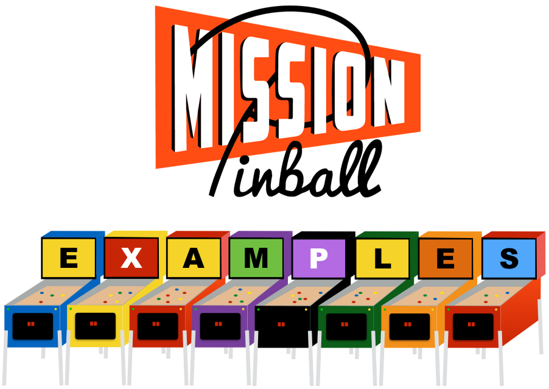

Mission Pinball Framework Examples
==================================

This GitHub repository contains example configuration, demos, and tutorial files for the Mission Pinball Framework. It's
a separate repo from the main MPF project so you can download this folder to an easily-accessible location.

The examples here are synchronized to work with the corresonding branches in MPF and the MPF-MC. (e.g. the "master"
branch of mpf-examples works with the master branch of mpf, the dev branch works with the dev branch, etc.)

If you're new to MPF, start with the tutorial at http://docs.missionpinball.org/en/latest/tutorial/.

More details about MPF are here: https://missionpinball.org.

Note that the branch of this repo corresponds to the branch of MPF. (e.g. the 'master' branch of examples here should
work with the master branch of MPF, the dev with the dev, etc.)

Description of Examples
=======================
The following folders contain helpful things and learning examples you can use as you create your own machine and learn
MPF.

demo_man
--------
Basic configuration for a 1994 Williams Demolition Man machine.

mc_demo
-------
A "slide show" demo showing off the features of the MPF Media Controller. You can run this and hit the right and left
arrow keys to step through the slides, and you can check out the config source to see how to do these things in your own
game.

starter_game
------------
A template you can use as a starting point for your own game. This is purely optional. Use it. Or not.

tutorial(s)
-----------
The tutorial folder (and all the folders that start with the name "tutorial") are companion files which you can use to
follow along with the step-by-step tutorial at http://docs.missionpinball.org/en/latest/tutorial/.

wpc_template
--------------------
Contains a template config which you can use as a starting point for a WPC-era machine.

License
=======
All of these examples are released via the MIT license (same as MPF), which means you can do pretty much anything you
want with them. Feel free to use anything you find here for your own game. You don't have to ask permission, or pay us,
or even give us credit. Just make an awesome game!!
